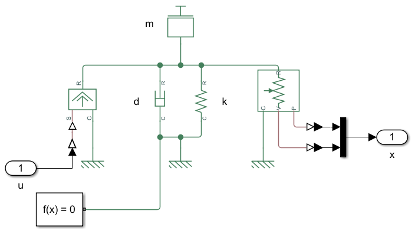
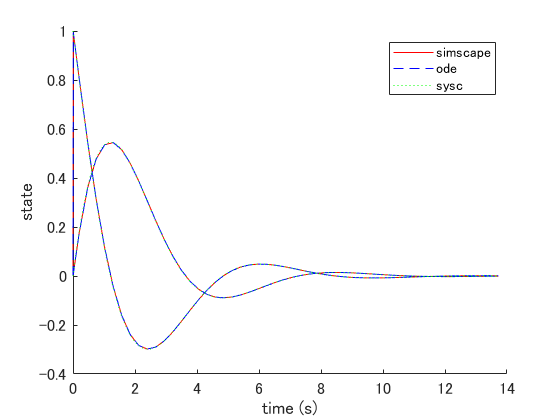
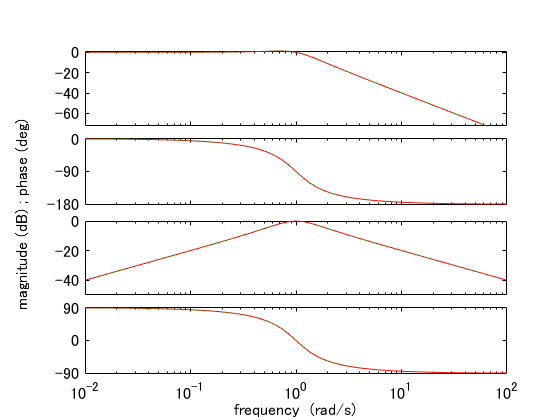

# Mass damper spring

## System equations

```math
m \ddot{q}(t) + d \dot{q}(t) + k q(t) = f(t)
```

## State space equation (plant_ode.m)

```math
\frac{d}{dt} \left[ \begin{array}{c}
q(t) \\ \dot{q}(t)
\end{array} \right]
=
\left[ \begin{array}{c}
\dot{q}(t) \\
-\frac{k}{m} q(t) - \frac{d}{m} \dot{q}(t) + \frac{1}{m} f(t)
\end{array} \right]
=:
f(x(t), u(t))
```

## Linear state space equation (plant_sysc.m)

### Equilibrium point

The equilibrium point satisfies $`f(x_e, u_e) = 0`$ thus,

```math
\begin{cases}
\dot{q}_e = 0 \\
q_e = \frac{1}{k} f_e
\end{cases}
```

### Linear state space equation

```math
\frac{d}{dt} \left[ \begin{array}{c}
q(t) \\ \dot{q}(t)
\end{array} \right]
=
\left[ \begin{array}{cc}
0 & 1 \\
-\frac{k}{m} & -\frac{d}{m}
\end{array} \right]

\left[ \begin{array}{c}
q(t) \\ \dot{q}(t)
\end{array} \right]
+
\left[ \begin{array}{c}
0 \\ \frac{1}{m}
\end{array} \right]

\left[ \begin{array}{c}
f(t)
\end{array} \right]
```

## Simscape (plant_simscape.m)



## Simulation

### Parameters (plant_params.m)

| Description | Value |
|-|-|
| mass $`m \mathrm{[kg]}`$ | $`1.0`$ |
| damping coefficient $`d \mathrm{[N \cdot s/m]}`$ | $`1.0`$ |
| spring constant $`k \mathrm{[N/m]}`$ | $`1.0`$ |

### Impulse response



where $`x_e = [0, 0]^T`$, $`u_e = [0]`$

### Bode plot



where $`x_e = [0, 0]^T`$, $`u_e = [0]`$
