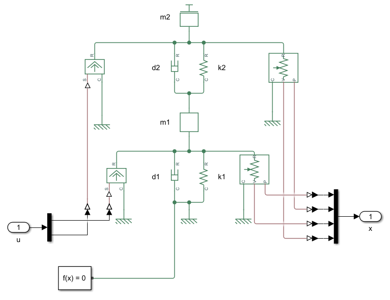
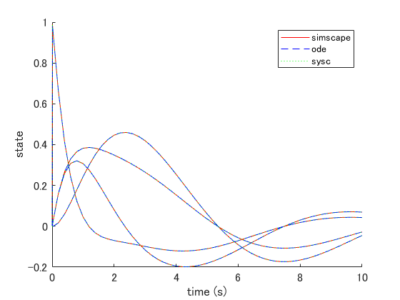
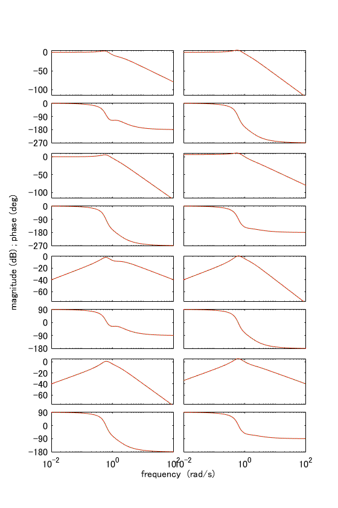

# Mass damper spring (2DOF)

## System equations

```math
\begin{cases}
m_1 \ddot{q}_1(t) + d_1 \dot{q}_1(t) + k_1 q_1(t) + d_2 [\dot{q}_1(t) - \dot{q}_2(t)] + k_2 [q_1(t) - q_2(t)] = f_1(t) \\

m_2 \ddot{q}_2(t) + d_2 [\dot{q}_2(t) - \dot{q}_1(t)] + k_2 [q_2(t) - q_1(t)] = f_2(t)
\end{cases}
```

## State space equation (plant_ode.m)

```math
\frac{d}{dt} \left[ \begin{array}{c}
q_1(t) \\ q_2(t) \\ \dot{q}_1(t) \\ \dot{q}_2(t)
\end{array} \right]
=
\left[ \begin{array}{c}
\dot{q}_1(t) \\
\dot{q}_2(t) \\
-\frac{k_1 + k_2}{m_1} q_1(t) + \frac{k_2}{m_1} q_2(t) - \frac{d_1 + d_2}{m_1} \dot{q}_1(t) + \frac{d_2}{m_1} \dot{q}_2(t) + \frac{1}{m_1} f_1(t) \\
\frac{k_2}{m_2} q_1(t) - \frac{k_2}{m_2} q_2(t) + \frac{d_2}{m_2} \dot{q}_1(t) - \frac{d_2}{m_2} \dot{q}_2(t) + \frac{1}{m_2} f_2(t)
\end{array} \right]
=:
f(x(t), u(t))
```

## Linear state space equation (plant_sysc.m)

### Equilibrium point

The equilibrium point satisfies $`f(x_e, u_e) = 0`$ thus,

```math
\begin{cases}
\dot{q}_{1e} = 0 \\
\dot{q}_{2e} = 0 \\
[k_1 + k_2] q_{1e} - k_2 q_{2e} = f_{1e} \\
-k_2 q_{1e} + k_2 q_{2e} = f_{2e}
\end{cases}
```

### Linear state space equation

```math
\frac{d}{dt} \left[ \begin{array}{c}
q_1(t) \\ q_2(t) \\ \dot{q}_1(t) \\ \dot{q}_2(t)
\end{array} \right]
=
\left[ \begin{array}{cccc}
0 & 0 & 1 & 0 \\
0 & 0 & 0 & 1 \\
-\frac{k_1 + k_2}{m_1} & \frac{k_2}{m_1} & -\frac{d_1 + d_2}{m_1} & \frac{d_2}{m_1} \\
\frac{k_2}{m_2} & -\frac{k_2}{m_2} & \frac{d_2}{m_2} & -\frac{d_2}{m_2}
\end{array} \right]

\left[ \begin{array}{c}
q_1(t) \\ q_2(t) \\ \dot{q}_1(t) \\ \dot{q}_2(t)
\end{array} \right]
+
\left[ \begin{array}{cc}
0 & 0 \\
0 & 0 \\
\frac{1}{m_1} & 0 \\
0 & \frac{1}{m_2}
\end{array} \right]

\left[ \begin{array}{c}
f_1(t) \\ f_2(t)
\end{array} \right]
```

## Simscape (plant_simscape.slx)



## Simulation

### Parameters (plant_param.m)

| Description | Value |
|-|-|
| mass $`m_1 \mathrm{[kg]}`$ | $`1.0`$ |
| damping coefficient $`d_1 \mathrm{[N \cdot s/m]}`$ | $`1.0`$ |
| spring constant $`k_1 \mathrm{[N/m]}`$ | $`1.0`$ |
| mass $`m_2 \mathrm{[kg]}`$ | $`1.0`$ |
| damping coefficient $`d_2 \mathrm{[N \cdot s/m]}`$ | $`1.0`$ |
| spring constant $`k_2 \mathrm{[N/m]}`$ | $`1.0`$ |

### Impulse response



where $`x_e = [0, 0, 0, 0]^T`$, $`u_e = [0, 0]`$.

### Bode plot



where $`x_e = [0, 0, 0, 0]^T`$, $`u_e = [0, 0]`$.
